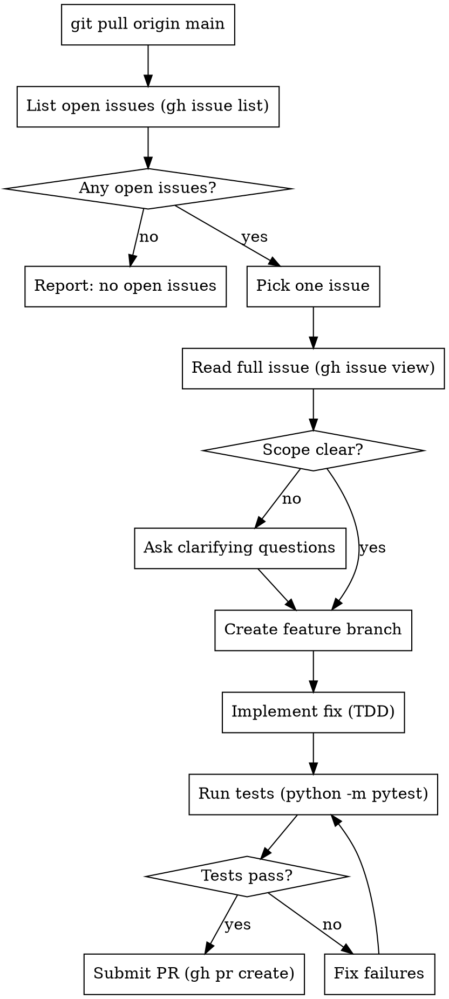

# Fix GitHub Issues

## Overview

Pull latest, read open issues, implement a fix, submit a PR. One issue per run.

## gh CLI

`gh` may not be on PATH in tool subprocess environments. Use the full path:

```powershell
$GH = "C:\Program Files\GitHub CLI\gh.exe"
& $GH issue list --repo thopper21/TNFamily
& $GH issue view <number> --repo thopper21/TNFamily
& $GH pr create --repo thopper21/TNFamily --title "..." --body "..."
```

**Never fall back to WebFetch for GitHub data.** Use `gh` exclusively.

## Workflow



## Picking an Issue

Pick the issue that is:
- Most clearly scoped (fewest unknowns)
- Not dependent on another open issue
- Or whichever the user specifies

If the issue description is ambiguous, **ask before starting work**.

## PR Body

Always reference the issue so GitHub auto-closes it on merge:

```
gh pr create --title "fix: ..." --body "$(cat <<'EOF'
## Summary
- <what changed>

## Test Plan
- [ ] All tests pass (python -m pytest)
- [ ] Manually verified in browser

Closes #<issue-number>
EOF
)"
```

## Required Skills

- **superpowers:test-driven-development** — write tests first for every change
- **superpowers:brainstorming** — if scope needs design discussion before implementation

## Project Notes

- Tests: `python -m pytest` (in-memory SQLite, no setup needed)
- Single test: `python -m pytest tests/test_grocery.py::test_name -v`
- Update `README.md` if the change adds a new blueprint, model, or route pattern
